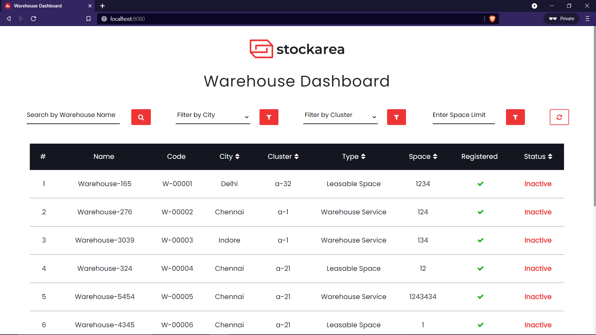
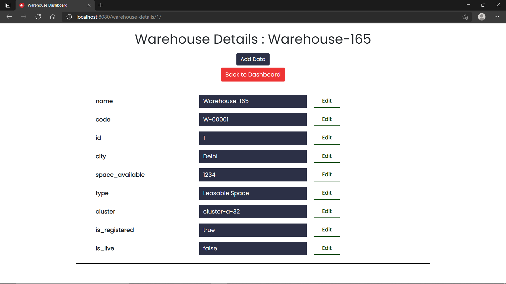

# VueJS/Bootstrap Dashboard Template

`stockarea.io`

## Tech Stack Used :

- VueJS 3
- Bootstrap
- VueX : State Management
- Vue Router : Routing

## Pages

- <b>Home ( / )</b>

  Displays data populated from local json file `warehouses.json`.

  Key Features

  - Searching by Warehouse Name.
  - Sorting based on Space, Status, City, Type and Cluster.
  - Filtering based on Space, Cluster and City.

- <b>Details ( /warehouse-details/:id )</b>

  Displays individual data of selected warehouse.

  Key Features

  - Editing data values of each field.
  - Adding new fields to exisiting object.

## Project Screenshots

<h3>Main Dashboard Screen with Visualized Data</h3>


<h3>Individual Warehouse Screen with Details</h3>



## Project Setup

```
npm install
```

### Compiles and hot-reloads for development
```
npm run serve
```

### Compiles and minifies for production
```
npm run build
```

### Lints and fixes files
```
npm run lint
```

### Customize configuration
See [Configuration Reference](https://cli.vuejs.org/config/).


